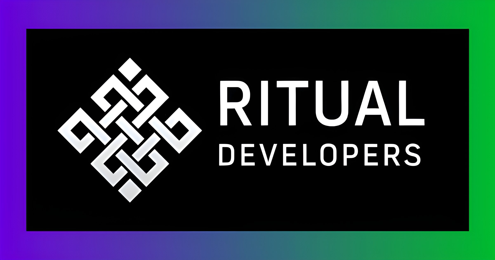

# Oracast Markets

[](LICENSE)
[](https://nextjs.org/)
[](https://hono.dev/)
[](https://www.typescriptlang.org/)

A modern cryptocurrency market data platform built with [Hono.js](https://hono.dev/) and [Next.js](https://nextjs.org/). Provides real-time price, volume, and volatility data through an intuitive UI and RESTful API endpoints optimized for blockchain integration.



## ✨ Features

- **Real-time Market Data** — Live cryptocurrency prices, volumes, and volatility from CoinGecko
- **Blockchain-Ready API** — uint256-encoded values scaled to 1e18 for direct smart contract consumption
- **Fallback Resilience** — Automatic failover to Coinbase API with intelligent caching
- **Naïve Forecasting** — Trend-based price predictions with 60-day backtested confidence scores
- **Modern UI** — Responsive, branded interface with per-token theming

## 🚀 Quick Start

### Prerequisites

- [Node.js](https://nodejs.org/) 18+ or [Bun](https://bun.sh/) (recommended)

### Installation

```bash
# Clone the repository
git clone https://github.com/RitualChain/oracast-markets.git
cd oracast-markets

# Install dependencies
bun install
# or: npm install

# Start development server
bun dev
# or: npm run dev
```

Open [http://localhost:3000](http://localhost:3000) in your browser.

## 📖 API Reference

### Smart Contract Endpoint

```http
GET /api/features/:id
```

Returns uint256-encoded values optimized for on-chain consumption:

```json
{
  "price": "97382000000000000000000",
  "volume": "110903448964000000000000000000",
  "volatility": "6173220000000000000",
  "direction": 1,
  "forecast": {
    "mean": "103555220000000000000000",
    "low": "97159526340000000000000",
    "high": "109950913660000000000000"
  },
  "fitness": "854200000000000000000"
}
```

### Display Endpoint

```http
GET /api/features/all/:id
```

Returns human-readable values with additional metadata:

```json
{
  "price": 97382.0,
  "volume": 110903448964,
  "volatility": 6.17,
  "direction": 1,
  "forecast": { "mean": 103555.22, "low": 97159.53, "high": 109950.91 },
  "fitness": 85.42,
  "name": "Bitcoin",
  "symbol": "BTC",
  "lastUpdated": "2026-01-15T12:00:00.000Z",
  "source": "coingecko"
}
```

### Other Endpoints

| Endpoint | Description |
|----------|-------------|
| `GET /api/health` | Health check |
| `GET /api/coins/list` | Top 25 cryptocurrencies |
| `GET /api/price/:id` | Price only (uint256) |

See [docs/integration.md](docs/integration.md) for detailed API documentation.

## 🏗️ Architecture

```
┌─────────────────┐     ┌──────────────────┐     ┌─────────────────┐
│   User/Client   │────▶│   Next.js API    │────▶│  CoinGecko API  │
│                 │     │   (Hono Routes)  │     │   (Primary)     │
└─────────────────┘     └──────────────────┘     └─────────────────┘
                               │                         │
                               ▼                         ▼
                        ┌──────────────────┐     ┌─────────────────┐
                        │  In-Memory Cache │     │  Coinbase API   │
                        │   (TTL-based)    │     │   (Fallback)    │
                        └──────────────────┘     └─────────────────┘
```

### Tech Stack

- **Framework**: Next.js 16 (App Router)
- **API**: Hono.js 4.10
- **Frontend**: React 19, TypeScript
- **Styling**: Tailwind CSS, Radix UI

### Project Structure

```
oracast-markets/
├── app/
│   ├── api/[...route]/     # Hono API routes
│   ├── features/           # Main data display component
│   └── [..id]/             # Dynamic coin routes
├── components/ui/          # Reusable UI components
├── lib/                    # Utilities and constants
├── docs/                   # API documentation
└── public/                 # Static assets
```

## ⛓️ Smart Contract Integration

The API provides uint256-encoded values for direct blockchain consumption:

```solidity
contract PriceOracle {
    uint256 public price;
    uint256 public volume;
    uint256 public volatility;
    uint256 public direction;

    function updateFeatures(
        uint256 _price,
        uint256 _volume,
        uint256 _volatility,
        uint256 _direction
    ) external onlyOwner {
        price = _price;
        volume = _volume;
        volatility = _volatility;
        direction = _direction;
    }
}
```

See [docs/a2a.md](docs/a2a.md) for the complete AI agent integration guide.

## 🔧 Configuration

### Adding Tokens

Edit `lib/constants.ts` to add new cryptocurrencies:

```typescript
export const TOKEN_LIST_DEFAULT: Token[] = [
  {
    id: 'bitcoin',        // CoinGecko ID
    name: 'Bitcoin',
    symbol: 'BTC',
    logo: 'https://assets.coingecko.com/...',
    brandColor: '#F7931A',
    brandBgColor: '#FFF4E6',
  },
  // Add more tokens...
];
```

### Environment Variables

Copy `.env.example` to `.env.local` for custom configuration. See the file for available options.

## 📚 Documentation

- [API Integration Guide](docs/integration.md) — Detailed API documentation
- [Agent Integration (A2A)](docs/a2a.md) — Guide for AI agents and smart contracts
- [Security Audit](SECURITY_AUDIT.md) — Full security assessment

## 🚢 Deployment

### Vercel (Recommended)

[](https://vercel.com/new/clone?repository-url=https://github.com/RitualChain/oracast-markets)

1. Push your code to GitHub
2. Import your repository in Vercel
3. Deploy automatically

### Other Platforms

```bash
# Build for production
bun run build

# Start production server
bun run start
```

## 🤝 Contributing

Contributions are welcome! Please read [CONTRIBUTING.md](CONTRIBUTING.md) for guidelines.

1. Fork the repository
2. Create your feature branch (`git checkout -b feature/amazing-feature`)
3. Commit your changes (`git commit -m 'feat: add amazing feature'`)
4. Push to the branch (`git push origin feature/amazing-feature`)
5. Open a Pull Request

## 🔒 Security

- See [SECURITY.md](SECURITY.md) for our security policy
- See [SECURITY_AUDIT.md](SECURITY_AUDIT.md) for the full security audit
- Report vulnerabilities to: security@bunsdev.com

## 📄 License

This project is licensed under the MIT License — see the [LICENSE](LICENSE) file for details.

## 👤 Author

**Val Alexander** — [bunsdev.com](https://bunsdev.com)

---

<p align="center">
  Built with ❖ for <a href="https://links.ritual.tools">Ritual Devs</a>
</p>
